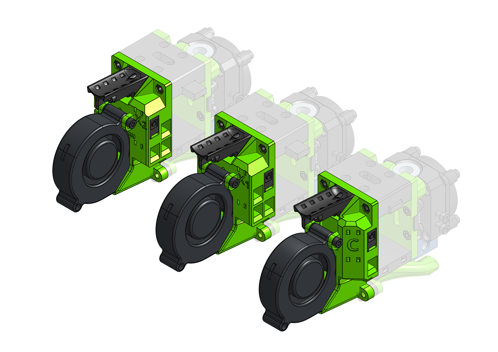
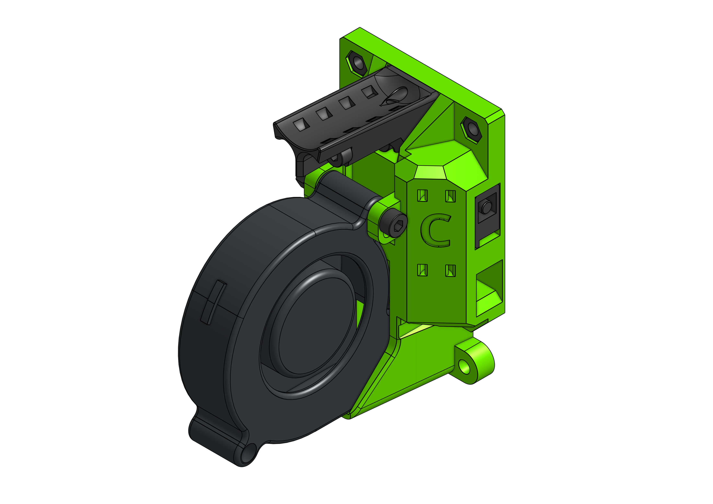
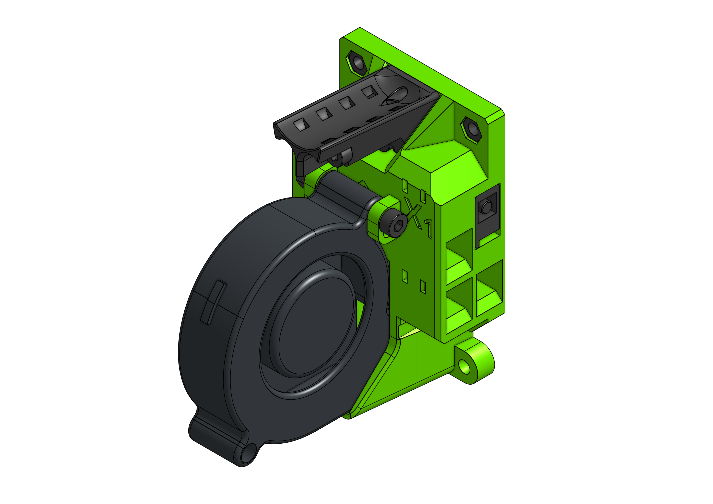
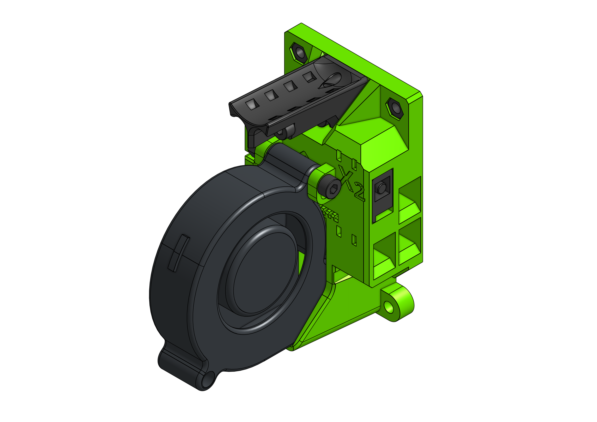

# Cartesian and IDEX support

EVA 2 supports not only CoreXY printers. You can also use it on a 6mm belt cartesian or even IDEX system.

??? warning "IDEX Z offset caveat"

    Z offset regulation is not figured out yet - as of today the assumption (as unrealistic as it maybe) is that the tips of both nozzles are at the same Z offset.

??? info "Front belt holders"

    On a cartesian/IDEX type EVA the front belt holders are reundant - there are no belts in the front.

### BOM

=== "Cartesian"

    <add-bom-button name="{{ meta.uid }} (cartesian)">
        {{ get_bom("cartesian").json()|b64encode }}
    </add-bom-button>

    

    {{ get_bom("cartesian").md_table(8) }}

=== "IDEX X1"

    <add-bom-button name="{{ meta.uid }} (idex_x1)">
        {{ get_bom("idex_x1").json()|b64encode }}
    </add-bom-button>

    

    {{ get_bom("idex_x1").md_table(8) }}

=== "IDEX X2"

    <add-bom-button name="{{ meta.uid }} (idex_x2)">
        {{ get_bom("idex_x2").json()|b64encode }}
    </add-bom-button>

    

    {{ get_bom("idex_x2").md_table(8) }}

### Links

{{ download_button }}
{{ cad_link }}
