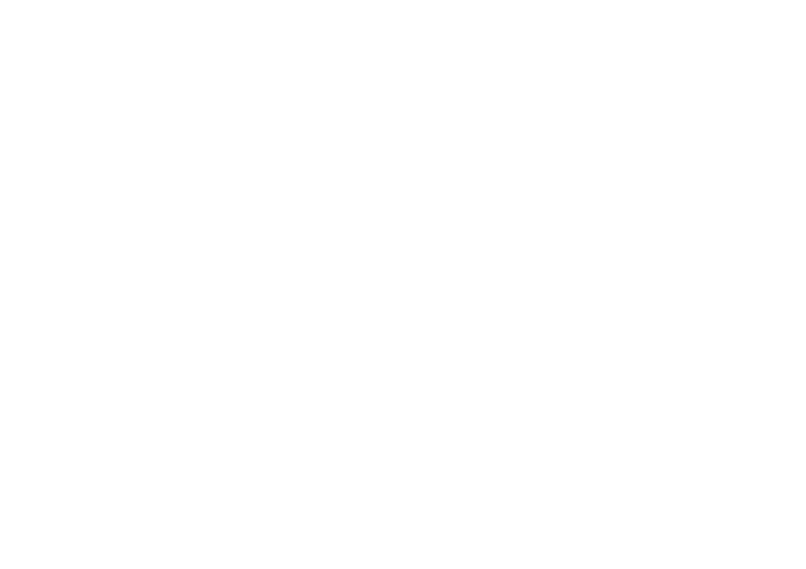

# {{ meta.title }}

## Description

There are different results when it comes to the default duct. In case there's need for that one can try to use the Low / Wide variant of the duct, it's further from the heat block and closer to the bed.



## Links

{{ download_button }}


