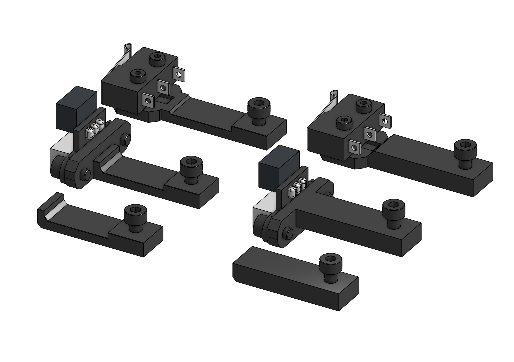

## Standard

All EVA carriages have endstop slots in their `top` parts. Those are different depending on the MGN carriage but **consistent** in their spec. This is to make it easy to design different endstop mounts.

By default 3 types are provided.

=== "Sensorless"

    === "MGN12"

        <add-bom-button name="{{ meta.uid }} (sensorless_MGN12)">
            {{ get_bom("BOM_Endstops.sensorless.MGN12").json()|b64encode }}
        </add-bom-button>
        
        {{ get_bom("BOM_Endstops.sensorless.MGN12").md_table(8) }}

    === "MGN15"

        <add-bom-button name="{{ meta.uid }} (sensorless_MGN15)">
            {{ get_bom("BOM_Endstops.sensorless.MGN15").json()|b64encode }}
        </add-bom-button>
        
        {{ get_bom("BOM_Endstops.sensorless.MGN15").md_table(8) }}

=== "Angled Endstop"

    === "MGN12"

        <add-bom-button name="{{ meta.uid }} (angled_MGN12)">
            {{ get_bom("BOM_Endstops.angled.MGN12").json()|b64encode }}
        </add-bom-button>
        
        {{ get_bom("BOM_Endstops.angled.MGN12").md_table(8) }}

    === "MGN15"

        <add-bom-button name="{{ meta.uid }} (angled_MGN15)">
            {{ get_bom("BOM_Endstops.angled.MGN15").json()|b64encode }}
        </add-bom-button>
        
        {{ get_bom("BOM_Endstops.angled.MGN15").md_table(8) }}

=== "Openbuilds"

    === "MGN12"

        <add-bom-button name="{{ meta.uid }} (openbuilds_MGN12)">
            {{ get_bom("BOM_Endstops.openbuilds.MGN12").json()|b64encode }}
        </add-bom-button>
        
        {{ get_bom("BOM_Endstops.openbuilds.MGN12").md_table(8) }}

    === "MGN15"

        <add-bom-button name="{{ meta.uid }} (openbuilds_MGN15)">
            {{ get_bom("BOM_Endstops.openbuilds.MGN15").json()|b64encode }}
        </add-bom-button>
        
        {{ get_bom("BOM_Endstops.openbuilds.MGN15").md_table(8) }}

## Links

{{ download_button }}
{{ cad_link }}
