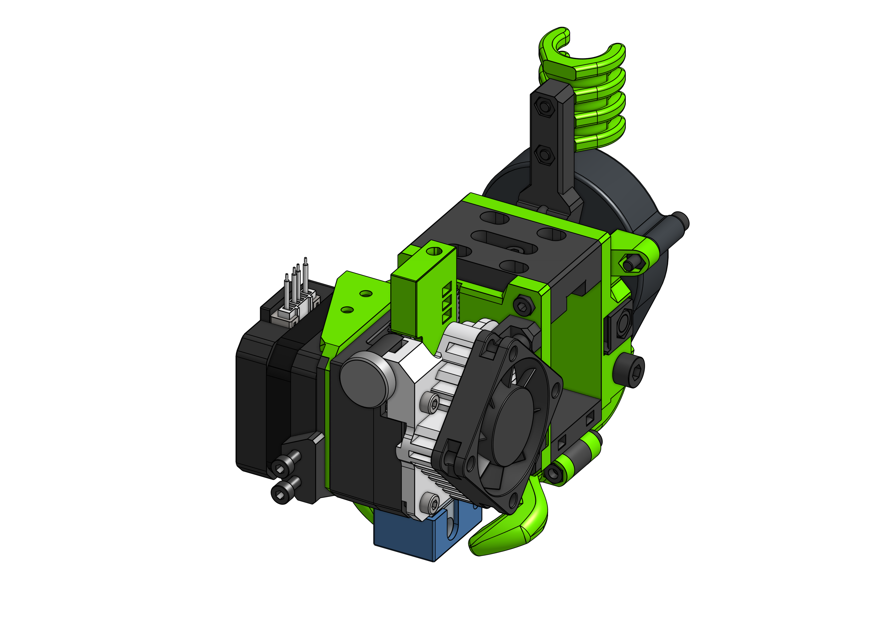

# Aero

??? danger "Deprecation warning"

    Aero will be be marked as obsolete in the next minor release of EVA. The reason is that while Aero served us well for all those years it is now not used very often while being plenty of work to maintain it (like every other drive).

    Deprectaion means that this is the last release Aero got an update, next time it will be marked as *obsolete*. This means that it will stop receiving upgrades but will forever be available in the 2.3.0 version in it's [submodule repository](https://github.com/EVA-3D/eva-aero).

E3D Aero is a difficult to align extruder. It's one of those "front heavy" ones, where the motor is not over the center of the MGN Carriage but instead is "pulling" the carriage down by the front - this does not mean that it's worse than the others and will most likely not be enough for a MGN carriage to even care - just something to have in mind. That and the fact that due to the dimensions of it's assembly the whole print area of one's printer may not be accessible.

??? question "Why not bellow the rail?"

    I tried that. The distance to the anchor (MGN Carriage) with the weight of the motor produced enough force to output very bad Y ghosting. 

Aero has two options for bed probe mounting - one on the side (taking away X space) and one of the front (taking away Y space) with a different `aero_front_probe` part (listed in the BOM).

Assemble the carriage on the rail, add the motor and Aero last.

!!! tip "Custom Titan Tension Arm"

    {: align=left }

    The BOM contains my remix of the [E3D Titan Flex Upgrade](https://www.thingiverse.com/thing:2426505) thing which improves the Titan filament path greatly.

    My remix improves it's printability - print on the side where the spring is. No supports are needed.

    You can ommit the `SSX_tensioner_thing_2426505` part from the BOM if you plan on using the original arm.

### Bill of materials

=== "MGN12"

    <add-bom-button name="{{ meta.uid }} (MGN12)">
        {{ get_bom("Aero.MGN12").json()|b64encode }}
    </add-bom-button>
    
    {{ get_bom("Aero.MGN12").md_table(4) }}

=== "MGN15"

    <add-bom-button name="{{ meta.uid }} (MGN15)">
        {{ get_bom("Aero.MGN15").json()|b64encode }}
    </add-bom-button>
    
    {{ get_bom("Aero.MGN15").md_table(4) }}

### Links

{{ download_button }}
{{ cad_link }}

