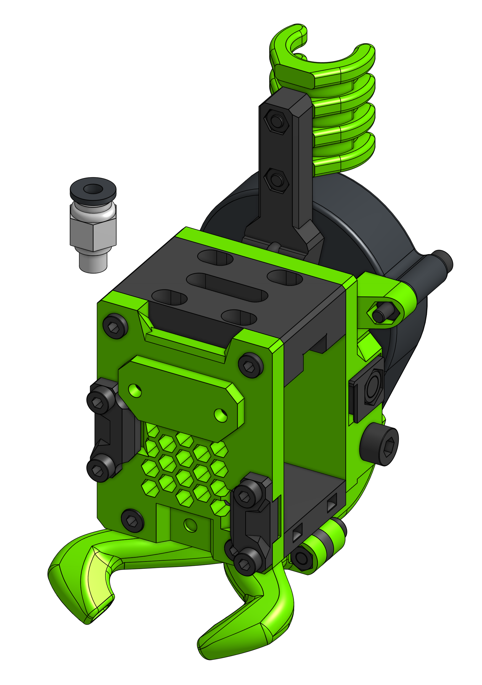

# Bowden

As I don't expect this one to be used much on CoreXY machines it will come handy for some V-casts or cantilever printers. EVA 2 / Bowden is built with the base parts of EVA that are later on "remixed" to achieve different drive types.

!!! info "Universal EVA Front"

    This drive uses the universal face, which means it's comatible with all hotends you can find in the Hotends section.

??? info "PC4-M6"

    Mosquito, Dragon and V6 (clones) that do not have the PTFE grabbing collar do need a PC4-M6 "pneumatic fitting" on the hot end side to grab the bowden tube. The parts do not have threads but the hole size allows for self-tapping.

    

    Make sure to get the connector that allows the bowden to go through it:

    

### Bill of materials

=== "MGN12"

    <add-bom-button name="{{ meta.uid }} (MGN12)">
        {{ get_bom("Bowden.MGN12").json()|b64encode }}
    </add-bom-button>
    
    {{ get_bom("Bowden.MGN12").md_table(4) }}

=== "MGN15"

    <add-bom-button name="{{ meta.uid }} (MGN15)">
        {{ get_bom("Bowden.MGN15").json()|b64encode }}
    </add-bom-button>
    
    {{ get_bom("Bowden.MGN15").md_table(4) }}

### Links

{{ download_button }}
{{ cad_link }}
