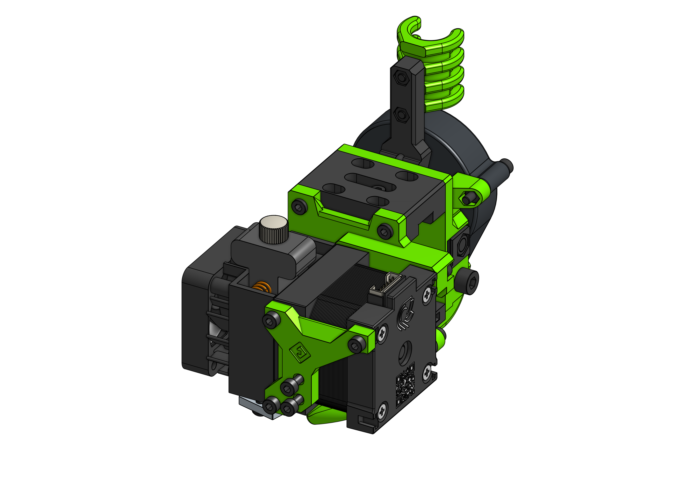

# Hemera

E3D Hemera is another example of the front heavy EVAs. The motor is huge and the whole extruder takes a lot of space so make sure to understand that the full print volume may not be accessible when using this EVA variant.

??? question "Why not bellow the rail?"

    I tried that on Aero - more informatino there.

Hemera's motor needs to be put on quite early in the assembly process, remember to grab the right belt before putting it on.

### Bill of materials

=== "MGN12"

    <add-bom-button name="{{ meta.uid }} (MGN12)">
        {{ get_bom("Hemera.MGN12").json()|b64encode }}
    </add-bom-button>
    
    {{ get_bom("Hemera.MGN12").md_table(4) }}

=== "MGN15"

    <add-bom-button name="{{ meta.uid }} (MGN15)">
        {{ get_bom("Hemera.MGN15").json()|b64encode }}
    </add-bom-button>
    
    {{ get_bom("Hemera.MGN15").md_table(4) }}

### Links

{{ download_button }}
{{ cad_link }}
