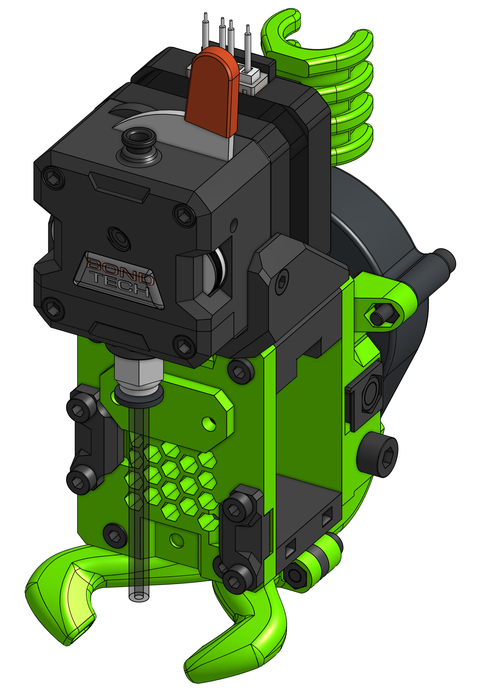

# LGX

!!! info "Universal EVA Front"

    This drive uses the universal face, which means it's comatible with all hotends you can find in the Hotends section.

??? Question "What about LGX For Flexibles Set?"

    I'm working on it :)

### Bill of materials

=== "MGN12"

    <add-bom-button name="{{ meta.uid }} (MGN12)">
        {{ get_bom("LGX.MGN12").json()|b64encode }}
    </add-bom-button>
    
    {{ get_bom("LGX.MGN12").md_table(4) }}

=== "MGN15"

    <add-bom-button name="{{ meta.uid }} (MGN15)">
        {{ get_bom("LGX.MGN15").json()|b64encode }}
    </add-bom-button>
    
    {{ get_bom("LGX.MGN15").md_table(4) }}

#### PTFE Tube lenghts

| Hotend | Length |
| ------ | ------ |
| Mosquito | 30.4 mm |
| E3D V6 | 46.9 mm |
| Dragon | 31.9 mm |
| Copperhead | 45.9 mm |

### Links

{{ download_button }}
{{ cad_link }}
