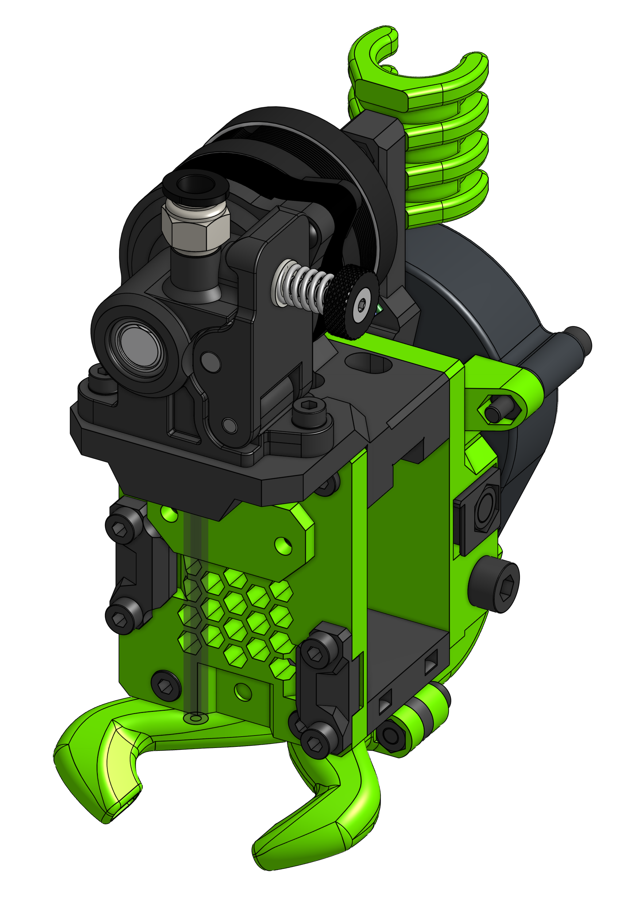

# Orbiter

EVA 2 now supports [The Orbiter](https://www.thingiverse.com/thing:4725897){target=_blank} created by Robert Lorincz. 

Since EVA 2.2.1 Orbiter 1.5 is the only supported version of the Orbiter.

!!! info "Universal EVA Front"

    This drive uses the universal face, which means it's comatible with all hotends you can find in the Hotends section.

??? info "Orbiter 1.0 users"

    Old parts supporting the old Orbiter can be found in git history on tag [2.2.0](https://github.com/EVA-3D/eva-orbiter/tree/2.2.0/stls){target=_blank}

### BOM

=== "MGN12"

    <add-bom-button name="{{ meta.uid }} (MGN12)">
        {{ get_bom("Orbiter.MGN12").json()|b64encode }}
    </add-bom-button>
    
    {{ get_bom("Orbiter.MGN12").md_table(4) }}

=== "MGN15"

    <add-bom-button name="{{ meta.uid }} (MGN15)">
        {{ get_bom("Orbiter.MGN15").json()|b64encode }}
    </add-bom-button>
    
    {{ get_bom("Orbiter.MGN15").md_table(4) }}

#### PTFE Tube lenghts

| Hotend | Length |
| ------ | ------ |
| Mosquito | 60.3 mm |
| E3D V6 | 43.8 mm |
| Dragon | 45.3 mm |
| Copperhead | 59.3 mm |

### Links

{{ download_button }}
{{ cad_link }}
