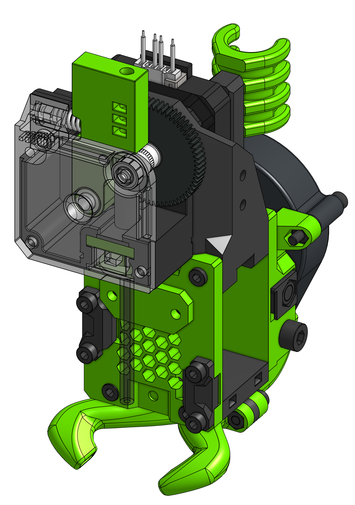

# Titan

EVA / Titan is the oldest and in my opinion one of the best variants. It was the original and only extruder option for the first [Easy-Mod](https://eva-3d.github.io/easy-mod/) - later was moved to a separate project which EVA become :smile:  
Since EVA 2.0.0 it does not require a unique `front` part, just a `top` (like BMG) which makes it not only easier to assemble but also to maintain. One can opt to use the `press fit` part if is lacking a groove mount adapter.  
There is a PTFE tube going from the Titan to the hotend so it's not as "direct" as one could imagine but still the print quality is excellent (or at least not impeded by the carriage). 

!!! info "Universal EVA Front"

    This drive uses the universal face, which means it's comatible with all hotends you can find in the Hotends section.

!!! tip "Custom Titan Tension Arm"

    {: align=left }

    The BOM contains my remix of the [E3D Titan Flex Upgrade](https://www.thingiverse.com/thing:2426505) thing which improves the Titan filament path greatly.

    My remix improves it's printability - print on the side where the spring is. No supports are needed.

    You can ommit the `SSX_tensioner_thing_2426505` part from the BOM if you plan on using the original arm.

### Bill of materials

=== "MGN12"

    <add-bom-button name="{{ meta.uid }} (MGN12)">
        {{ get_bom("Titan.MGN12").json()|b64encode }}
    </add-bom-button>
    
    {{ get_bom("Titan.MGN12").md_table(4) }}

=== "MGN15"

    <add-bom-button name="{{ meta.uid }} (MGN15)">
        {{ get_bom("Titan.MGN15").json()|b64encode }}
    </add-bom-button>
    
    {{ get_bom("Titan.MGN15").md_table(4) }}

#### PTFE Tube lenghts

| Hotend | Length |
| ------ | ------ |
| Mosquito | 73.4 mm |
| E3D V6 | 56.9 mm |
| Dragon | 58.4 mm |
| Copperhead | 72.4 mm |

### Links

{{ download_button }}
{{ cad_link }}
