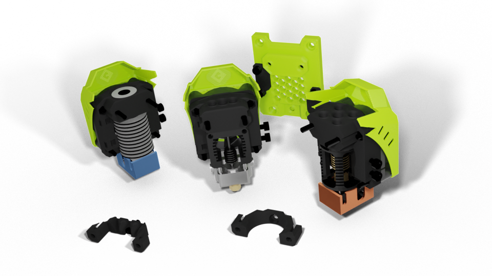
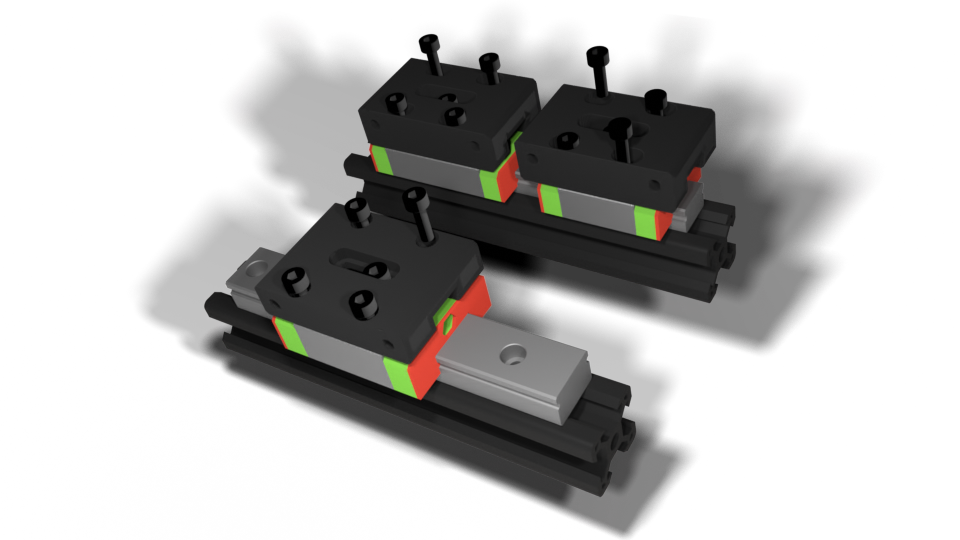

## Roadmap

### Future

- [ ] REVO Support (it's prepared but I can't publish yet)
- [ ] HIC Support
- [ ] EVA 3.0 :question:
### EVA 2.4.0

- [x] Nova Hotend support
- [x] BMO Hotend support
- [x] Rapido Hotend support
- [x] LGX Lite support
- [x] Sherpa Extruder Support
- [x] Additional/improved Cooling (TriHorn Duct)

### EVA 2.3.0

- [x] Bondtech LGX Support
- [x] Slice Engineering Copperhead support
- [x] Additional variants of Horns Ducts 2.1
- [x] Box BOM management system in the documentation
- [x] Split Hotends from drives (easier maintenence)
- [x] Add belt slots in the universal front

### EVA 2.2.0

- [x] Orbiter Support
- [x] MGN12H Support
- [x] Double side endstops
- [x] Openbuilds microswitch support

### EVA 2.1.0

- [x] Dragon Support
- [x] Universal Front
- [x] 3-point hotend mounting
- [x] Mosquito 40mm fan mount

### EVA 2.0.0

- [x] Belt path change and front belt mounting
- [x] Revamped repository organisation
- [x] Shrouds!
- [x] Modular endstops
- [x] Additional cable paths
- [x] Horns Ducts 2.1
- [x] Redesigned probe mounts

### Dropped ideas

- [ ] Duet Toolboard support (possibly for [contrib](https://contrib.eva-3d.page))
- [ ] Bondtech LGX **FFS** Support (non-FFS was added in 2.3.0)

## Features

### It's a standard

If a printer is "EVA Compatible" then it's automatically compatible with everything that comes with EVA - hotends, drives, endstops, bed probes.
A printer can lock to a specific EVA version and update when the change is sigificant enough while the users can follow updates at a faster pace.

### Universal Front

EVA allows you to quickly swap a hotend without fiddling with the belts. Only 6-7 easily accessible screws need to be undone to take the hotend of the carriage to change it or for maintenance purposes.

Hotends compatible with universal front are: **V6**, **Mosquito** and **Dragon** (**Copperhead** and others are incoming).

### Drives

EVA supports different extrusion options - [Titan](../drives/titan), [BMG (and BMG-M)](../drives/bmg), [Orbiter](../drives/orbiter) are mounted on the top and are compatible with all available hotends.

### Backs

EVA can be mounted on printers with **CoreXY**, **Cartesian** and **IDEX** motion systems.

### MGN carriages

EVA can be mounted on **MGN12C** and **MGN12H** carriages. **MGN15C** support was dropped in 2.4.0.

### Bed probing

EVA comes with a defined place for 2 point probe mounting. That enables it to handle many probing solutions. **BL-Touch**, **Inductive probes** and **Duet Mini IR probe** (work in progress) are supported "out-of-the-box". 

