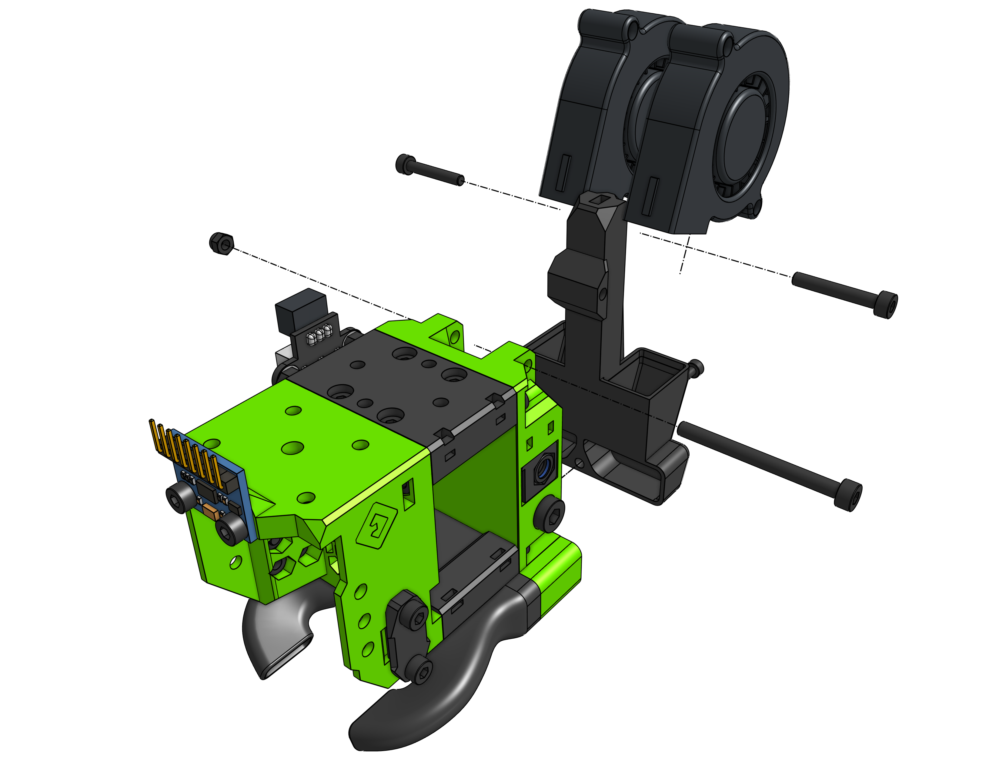
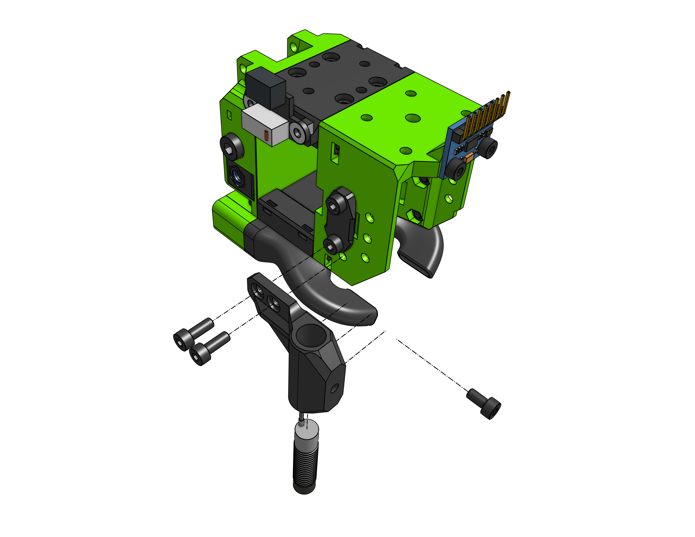

# Getting started

??? question "Just here for the files?"

    In that case navigate to [heat inserts](/heat_insert) or [hex nuts](/hex_nuts) sections.

EVA might look intimidating at first but it's really not, sure the BOMs are complicated and you need to learn yourself around all this but think about it like this:

## Printing

As for print settings I made them work for up to a 0.5 nozzle, although you might need to enable thin walls detection in your slicer then printing with a 0.5 nozzle. Aside from that you want ~1mm of perimeters (i.e. 2 perimeters with a 0.55mm perimeter width, or 3 perimeters with a 0.45mm perimeter width). As for infill 15% is enough.

## Printer compatibility

Even thought EVA 3 is a major version jump from EVA 2 a lot a work was put to achieve as much backwards compatibility, below you'll find information about specific printer compatibility:

### V-Core 3

The X endstop block needs to change - get taller, also **you will likely need longer belts** if you cut them short - close to the carriage.

I'm working on it.

### V-Minion

Almost there, sensorless homing should work, otherwise the X motor block on VM will need to be adjusted.

I'm working on it.

### V-Core Pro >= 1.2

Not yet, but the port should be similar to VC3.

### V-Cast

Not, depending on the demand and time I might port it but his will require some work.

## Parts explained

### Core

Let's define the 4 main components as the Core, this would be:

- `Top` - interface between the MGN12 and the rest of EVA
- `Front` - universal interface for hotend mounts
- `Bottom` - support piece integrated with a cooling duct option
- `Back` - different backs are use for different motion systems

### Drive

The component that goes on top of the `top` and `front` parts - specific to your chosen extruder option.

### Hotend

Component wrapping the hotend around provided mounting for the hotend fan and interfaces with the `front` part.

### Cooling Inlet

Component specific to your layer cooling fan option, attaches to the `back`.

### Cable Management

Provides means to attach or organize cables routed to the carriage, attaches to the `back`.

### Bed Probe

Goes on the `front` allows to mount the bed probe of your choosing.

### PTFE Lengths

You will need **one** piece of a PTFE tube going from the drive to the hotend. The length of that tube is different for each drive and hotend combo. To learn how much PTFE you need you can take a look at the BOM tables of you chosen drive and hotend and sum the two values (**do not cut into two pieces**).

below is an example of the Nova hotend and LGX as the drive. Nova needs 39.65 mm to the "roof" of the universal front, LGX needs 20.8 mm which gives us 60.45 mm. Those are the measurements taken from CAD, in the real world there's usually a 0.2mm difference. A good way to measure exactly is to assemble everything and put the PTFE cut to the calculated length into the hotend so it already goes through the top of the universal face and down the the heat break, then put your drive assembly on top and shave off any amount that is too long. You don't have to be super precise there.

