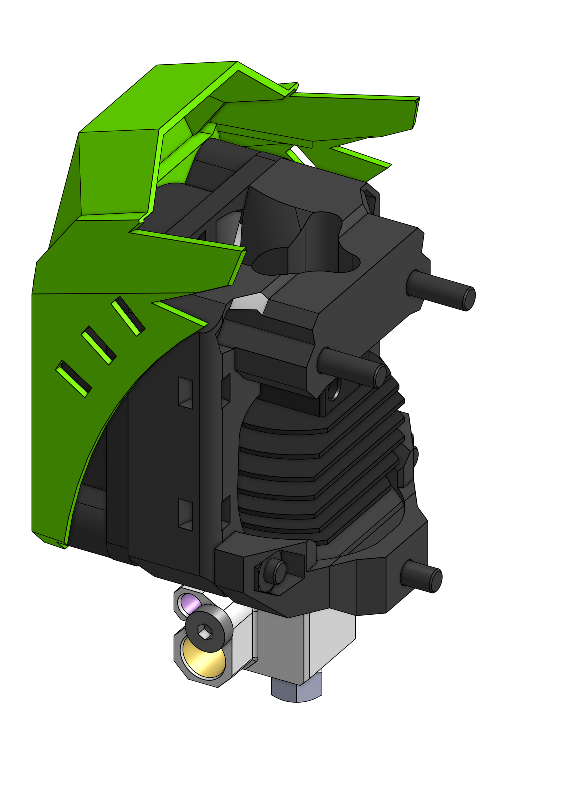

# Copperhead

## Bill of materials

<add-bom-button name="{{ meta.uid }}">
    {{ get_bom("Copperhead").json()|b64encode }}
</add-bom-button>

{{ get_bom("Copperhead").md_table(4) }}

## Links

{{ download_button }}
{{ cad_link }}
