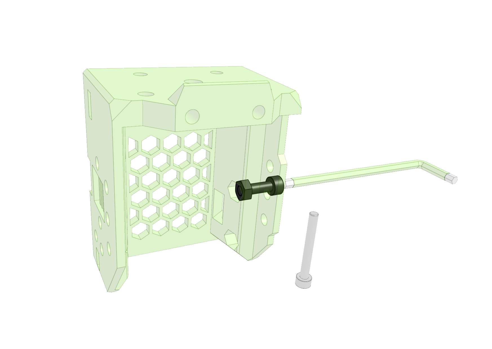
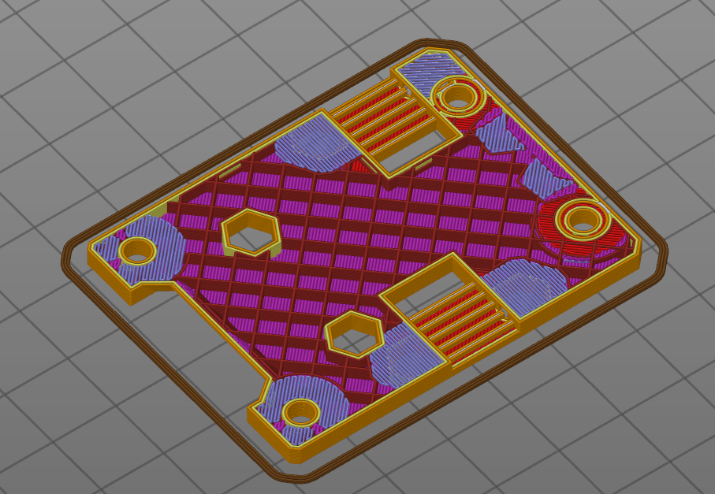
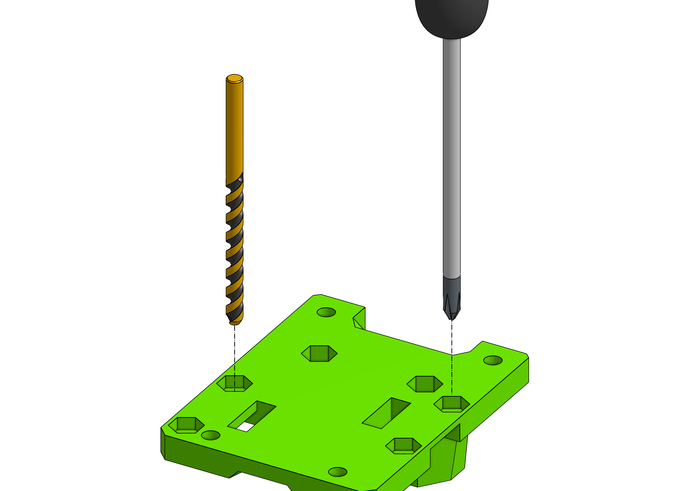

EVA 2 is designed to for 0.8 - 0.9 wall width (there are places where that should not be exceeded). Infill should not be less than 20% rectilinear. Most of the parts can be printed with 0.3 layer height but 0.2 is the safe bet.

## Printing orientation

The parts are not oriented in the print orientation. I am currently unavailable to maintain that but the rule is: find a big flat face and set it on the bed.

### Supports

Unless specified the parts require **no supports**. If your print orientation required supports then you oriented the part wrong :)

## Handling hex nuts

To properly insert a hex nut into a printed part you need to take a short screw, thread it through the hole, put the nut in, drive the nut untill it's properly sitting in it's place and finally remove the short screw. **This is very important** and will allow for the nut not to bind in the screw threads when you are mid-way through your assembly - when a nut binds the two parts are usually garbage and need to be reprinted.

## Pokey Pokey hole technique

When looking at the files or when slicing you will find that the holes are not there *that is by design* and while I know there are many techiques for achieving proper mid-air holes I am not able to consume the amount of work required to implement that for every single hole or sometimes there's not enough room for that.

There are 0.2 - 0.3 layers covering the holes to "trick" the slicer into thinking there is a bridge to be made. After printing you need to either drill, poke with a screw driver, allen key or even force the screw throuh that layer - all of the above works (drill being the fastest obviously).

You can see the blue spots (bridges) around the belt teeth are covering the holes fully.

