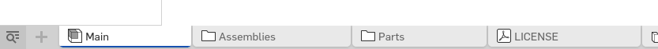

# STEP Files

The moment you've been waiting for is here - I'm releasing the source. Please remember that it's done under the [GPL-3.0 License]({{config.repo_url}}/blob/master/LICENSE).

## Using Onshape

Each release takes way too much work and if I was to export all STEP files I would go crazy - to get step files go to source, every Drives and Addons page that has a public Onshape link has a

There you will find every part that was ever created. Use the bottom bar to navigate:

Also have in mind the "configuration feature" I use - in the top left corner you will find different variants of some parts:

## Contribution Guide

Comming soon...
